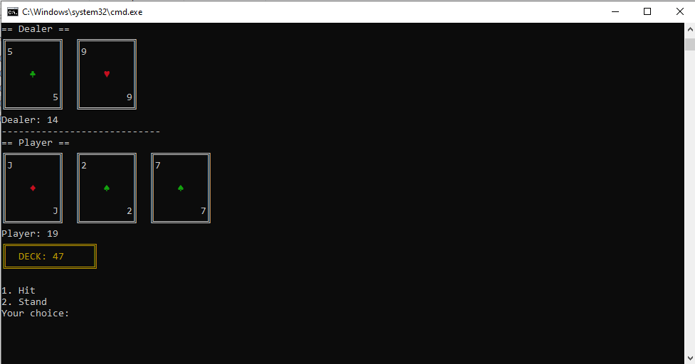

# Blackjack Game

This is a console-based card game for one player against the dealer.  
The game is played with a standard 52-card deck. Each round, the player places a bet and tries to beat the dealer by getting a hand value as close to 21 as possible without busting it.


## Built With
- Java 17


## How to Run
- Clone the repository
- Open dist/launcher.bat


## UML


## Demo


## Screenshots
  
  



## Project Structure

```BlackJack/
├── Enum/
│ ├── Rank.java
│ ├── Suit.java
│ └── GameResult.java
│
├── blackjack/
│ ├── Main.java
│ ├── Core/
│ │ ├── MainGame.java
│ │ ├── Menu.java
│ │ ├── RoundManager.java
│ │ ├── UIManager.java
│ │ └── Input.java
│ │
│ └── Object/
│ ├── Participant.java
│ ├── Player.java
│ ├── Dealer.java
│ ├── Card.java
│ ├── Hand.java
│ ├── Deck.java
│ └── BettingAccount.java
```

---

## Contributing
Contributions, issues, and feature requests are welcome.  

---

## License
[MIT](LICENSE)

